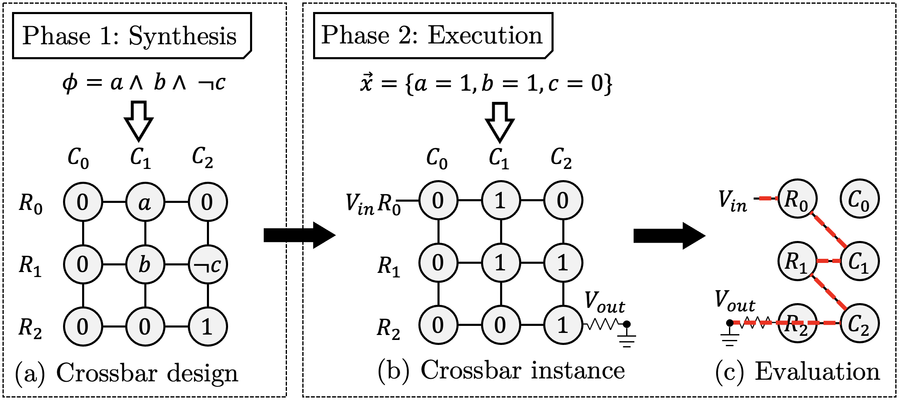
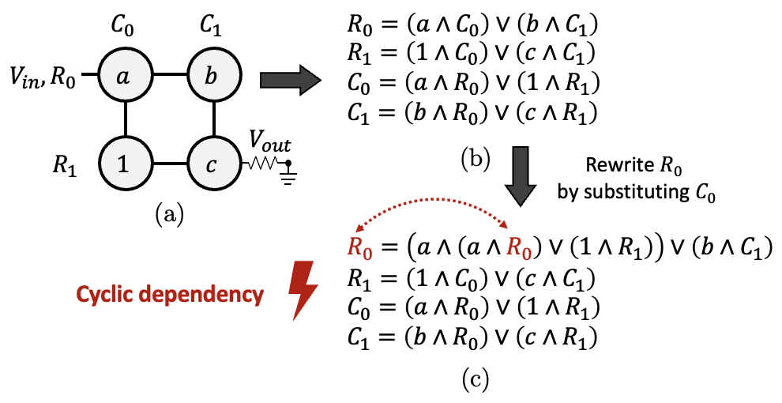
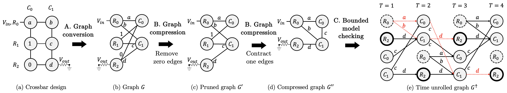
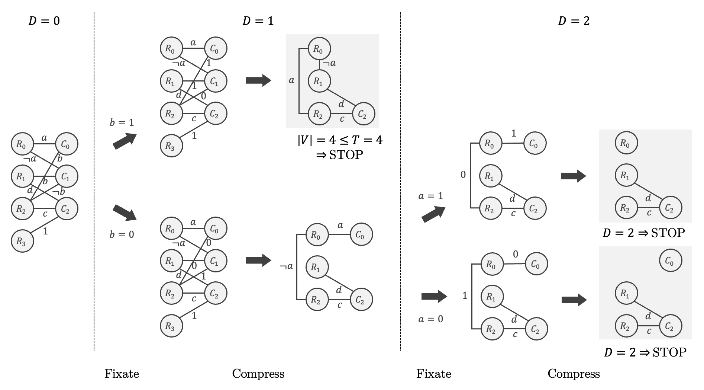

# Verification of Flow-Based Computing Systems using Bounded Model Checking

XSAT is  part of the [MemX](https://github.com/sventhijssen/memx) digital in-memory computing package. MemX supports both flow-based in-memory computing and path-based in-memory computing.

## Introduction
### Flow-based computing
Flow-based computing is a digital in-memory computing paradigm on nanoscale memristor crossbars. For an overview, please refer to Figure 1.
1. In the synthesis step, we synthesize a specification into a crossbar design. A crossbar design is an assignment of Boolean literals (Boolean variables and their negations), and Boolean truth values (0 and 1) to the memristors.
2. In the execution step, we are provided an input vector. The memristors are programmed to 0 or 1, according to the truth value of the input variables. Then, a high input voltage is supplied to the input wordline and the output wordline is grounded. Consequently, an electrical current will flow through the memristor crossbar. When there is a path from input to output through memristors with a logical state of 1, then the Boolean function evaluates to 1 (true). Otherwise, the Boolean function evaluates to 0 (false).


<br>
Figure 1: Flow-based computing

### Problem formulation
A memristor crossbar is an undirected bipartite graph. This makes that traditional SAT formulations cannot be directly applied for verification of a crossbar design.
Consider the crossbar design in Figure 2(a), and the equivalence relations between the rows and columns of the crossbar design in Figure 2(b).
Then we observe in Figure 2(c) that there is a cyclic dependency between these relations, which traditional SAT solvers cannot handle.


<br>
Figure 2: Cyclic dependency

### XSAT

#### Base formulation
Our solution method is based on bounded model checking. In Figure 3(a), we are given a crossbar design, which is subsequently converted into an undirected bipartite graph in Figure 3(b).
Next, the edges with label 0 are removed in Figure 3(c), and the edges with label 1 are contracted in Figure 3(d). Finally, we apply bounded model checking to the unrolled graph.


<br>
Figure 3: Bounded model checking

#### Divide-and-conquer
Further, we introduce a divide-and-conquer method where the problem is divided in multiple subproblems, as shown in Figure 4.


<br>
Figure 4: Divide and conquer

## Publications
- Thijssen, S., Singireddy, S., Rashed, M., Jha, S. K., & Ewetz, R. Verification of Flow-Based Computing Systems using Bounded Model Checking. In 42nd International Conference on Computer-Aided Design (ICCAD) 2023. Accepted.
- Thijssen, S., Jha, S. K., & Ewetz, R. (2022, October). [Equivalence Checking for Flow-Based Computing](https://ieeexplore.ieee.org/document/9662445). In 2022 IEEE 40th International Conference on Computer Design (ICCD) (pp. 656-663). IEEE.
- Singireddy, S., Ewetz, R., & Jha, S. (2022, June). [Deep Learning Toolkit-Driven Equivalence Checking of Flow-Based Computing Systems](https://ieeexplore.ieee.org/document/9869979). In 2022 IEEE 4th International Conference on Artificial Intelligence Circuits and Systems (AICAS) (pp. 50-53). IEEE.

## Related work
- Thijssen, S., Jha, S. K., & Ewetz, R. (2021, December). [Compact: Flow-based computing on nanoscale crossbars with minimal semiperimeter and maximum dimension](https://ieeexplore.ieee.org/document/9662445). IEEE Transactions on Computer-Aided Design of Integrated Circuits and Systems, 41(11), 4600-4611.
- Thijssen, S., Jha, S. K., & Ewetz, R. (2021, February). [Compact: Flow-based computing on nanoscale crossbars with minimal semiperimeter](https://ieeexplore.ieee.org/document/9473995). In 2021 Design, Automation & Test in Europe Conference & Exhibition (DATE) (pp. 232-237). IEEE.
- Thijssen, S., Jha, S. K., & Ewetz, R. (2023, January). [FLOW-3D: Flow-Based Computing on 3D Nanoscale Crossbars with Minimal Semiperimeter](https://ieeexplore.ieee.org/document/10044773/). In Proceedings of the 28th Asia and South Pacific Design Automation Conference (pp. 775-780).

## Requirements

### Windows

- Install and enable [Windows Subsystem for Linux](https://docs.microsoft.com/en-us/windows/wsl/install-win10#install-windows-subsystem-for-linux). 
- Python 3.6 or higher
- Optional: CPLEX 20.1.0.0

### Linux
- Python 3.6 or higher
- Optional: CPLEX 20.1.0.0

### MacOS
- Python 3.6 or higher
- Optional: CPLEX 20.1.0.0

## Installation

### Submodules
Clone this git repository and the required submodules ABC, and CPLEX. For ABC, make sure to clone the submodule from [here](https://github.com/sventhijssen/abc).
Clone the submodules using the following command:

```bash
git submodule update --init --recursive
```

#### ABC
Compile the ``ABC`` tool in the directory _abc_. 

```bash
cd abc
make
```

#### CPLEX
By default, CPLEX is the ILP solver. 
Download and install [CPLEX](https://www.ibm.com/analytics/cplex-optimizer), 
and make sure CPLEX is installed and the variable `cplex_path` in [config.py](src/aux/config.py) is set correctly for your OS.

#### Python packages and dependencies
Use the package manager [pip](https://pip.pypa.io/en/stable/) to install the Python dependencies in ``requirements.txt``.

```bash
pip3 install -r requirements.txt
```

## Bugs
### Fixate method in BooleanExpression for Verilog
The abstract class [BooleanExpression](src/core/expressions/BooleanExpression.py) provides a method `fix()` to fixate a literal. However, this does not seem to work correctly when parsing Verilog expressions.
Therefore, an alternative class [VerilogFix](src/aux/VerilogFix.py) was created. This is not as clean, but seems to work, and is currently used in [XSAT](src/verf/XSAT.py).

If anyone can find the bug for the Boolean expressions derived from Verilog, please feel free to contact me. Your help is greatly appreciated.

### Crossbar file format
The current version imports and exports a crossbar design in a format based JSON file format (see `write()` in [MemristorCrossbar](src/core/crossbars/MemristorCrossbar.py)). However, for compatibility, a deprecated file format is used in the experiments. When reading/writing a crossbar design, just use the flag `-depr`, which uses the deprecated classes [CrossbarReader](src/depr/CrossbarReader.py) and [CrossbarWriter](src/depr/CrossbarWriter.py).

### Parallelism
Writing parallel processing in Python is difficult, especially when each of the processes calls a subprocess (ABC in this case). For example, for XSAT, it was not clear to me how to kill a subprocess when another subprocess shows non-equivalence.

If you would like to discuss a solution method for this and/or the approaches I have attempted, please feel free to contact me. Your help is greatly appreciated.

## Usage
For examples on how to use the XSAT framework, please refer to the [_experiments_](experiments) directory, especially the files [experiments/ICCAD2023/xsat/xbar.py](experiments/ICCAD2023/xsat/xbar.py) and [experiments/ICCAD2023/xsat/xsat_base_own.py](experiments/ICCAD2023/xsat/xsat_base_own.py).

## Version
XSAT version 1.0.0

## Contact
_Sven Thijssen  
University of Central Florida  
sven.thijssen (at) ucf.edu  
https://www.sventhijssen.com/_

## References
- [ABC](https://people.eecs.berkeley.edu/~alanmi/abc/)
- [CPLEX](https://www.ibm.com/analytics/cplex-optimizer)
- [MCNC](https://ddd.fit.cvut.cz/www/prj/Benchmarks/index.php)
- [RevLib](http://www.informatik.uni-bremen.de/rev_lib/)

## License
    Copyright 2023 Sven Thijssen

    Licensed under the Apache License, Version 2.0 (the "License");
    you may not use this file except in compliance with the License.
    You may obtain a copy of the License at

        http://www.apache.org/licenses/LICENSE-2.0

    Unless required by applicable law or agreed to in writing, software
    distributed under the License is distributed on an "AS IS" BASIS,
    WITHOUT WARRANTIES OR CONDITIONS OF ANY KIND, either express or implied.
    See the License for the specific language governing permissions and
    limitations under the License.